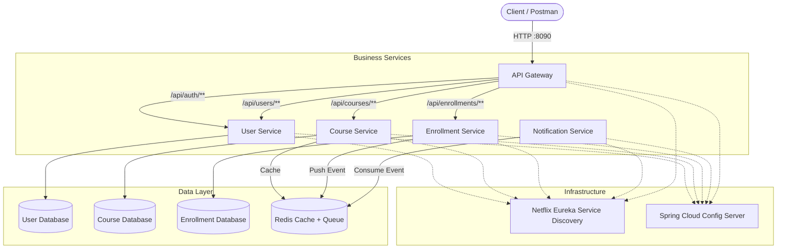

# Online Learning Platform (OLP)


---

# 📚 Overview

**Online Learning Platform (OLP)** is a cloud-native, microservices-based backend system designed for scalable online education platforms.

The system provides:

- Role-based authentication
- User management
- Course creation and management
- Student enrollment tracking
- Course progress management
- Asynchronous notifications
- Distributed caching
- Kubernetes-based deployment

The platform is built using **Spring Boot, Spring Cloud, Docker, Redis, PostgreSQL, and Kubernetes**.

All external requests enter through a centralized **API Gateway**, while internal services communicate through service discovery and asynchronous event processing.

---

# ✨ Features

## Authentication & Authorization

- JWT-based authentication
- Access and refresh tokens
- Role-Based Access Control (RBAC)
- Stateless security architecture
- Shared JWT validation library

Supported roles:

| Role | Permission |
|---|---|
| ADMIN | User and enrollment administration |
| INSTRUCTOR | Course management |
| STUDENT | Course enrollment and progress tracking |

---

## Course Management

- Create courses
- Update courses
- Delete courses
- Browse course catalog
- Redis-powered caching

---

## Enrollment Management

Students can:

- Enroll in courses
- Cancel enrollment
- Track progress
- Complete courses
- View enrollment history

---

## Notification System

The platform uses asynchronous event processing.

When an enrollment event occurs:

```
Enrollment Service
        |
        |
        v
 Redis Notification Queue
        |
        |
        v
Notification Service
```

The notification service processes events independently without blocking the enrollment workflow.

---

# 🏛 Architecture

The system follows a distributed microservices architecture.

External traffic flows through the API Gateway, while services register with Eureka and retrieve configuration from Spring Cloud Config.



---


# 🧱 Microservices

## API Gateway

**Port:** `8090`

Responsibilities:

- Single entry point
- Request routing
- Global CORS handling
- Service discovery integration


---

## Service Discovery (Eureka)

**Port:** `8761`

Responsibilities:

- Service registration
- Dynamic service lookup
- Load-balanced communication


---

## Config Server

**Port:** `8888`

Responsibilities:

- Centralized configuration
- Git-backed configuration repository
- Environment management


---

## User Service

**Port:** `8081`

Responsibilities:

- User registration
- Login
- JWT generation
- Refresh tokens
- Role management
- User administration


---

## Course Service

**Port:** `8082`

Responsibilities:

- Course CRUD operations
- Instructor ownership validation
- Course catalogue
- Redis caching


---

## Enrollment Service

**Port:** `8083`

Responsibilities:

- Student enrollment
- Progress tracking
- Completion management
- Course validation using WebClient
- Notification event publishing


---

## Notification Service

**Port:** `8084`

Responsibilities:

- Redis queue consumer
- Notification processing
- Async event handling

Unlike other services, this service exposes no public REST endpoints.

---

# 🛠 Technology Stack

| Category | Technology |
|---|---|
| Language | Java 17 |
| Framework | Spring Boot 4.1 |
| Cloud Framework | Spring Cloud 2025.1.2 |
| Security | Spring Security + JWT |
| API Gateway | Spring Cloud Gateway |
| Service Discovery | Netflix Eureka |
| Configuration | Spring Cloud Config |
| Database | PostgreSQL 15 |
| ORM | Spring Data JPA |
| Cache | Redis 7 |
| Messaging | Redis Queue |
| Containerization | Docker |
| Orchestration | Kubernetes |
| CI/CD | GitHub Actions |
| Build Tool | Maven |

---
# ⚡ Quick Start

This section explains how to run the Online Learning Platform locally using Kubernetes.

---

## 1. Clone Repository

Clone the repository:

```bash
git clone <repository-url>

cd online-learning-platform
```

---

## 2. Start Kubernetes Cluster

The project uses Kubernetes for deployment.

Ensure Docker Desktop is running and Kubernetes is enabled.

Verify the cluster:

```bash
kubectl get nodes
```

Expected output:

```
NAME             STATUS
docker-desktop   Ready
```

---

## 3. Build Shared Libraries

The platform contains shared modules used by multiple services.

Build them first:

```bash
mvn clean install -pl common-lib,security-lib -am
```

This builds:

- common-lib
- security-lib

which provide:

- Shared DTOs
- Base entities
- Exception handling
- JWT security utilities

---

## 4. Deploy Application

From the project root, execute:

```powershell
.\deploy.ps1
```

The deployment script applies Kubernetes resources in the required order:

```
Secrets

    ↓

PostgreSQL

    ↓

Redis

    ↓

Config Server

    ↓

Eureka Server

    ↓

Business Services

    ↓

API Gateway
```

---

## 5. Verify Running Pods

Check Kubernetes workloads:

```bash
kubectl get pods
```

Expected services:

```
api-gateway

user-service

course-service

enrollment-service

notification-service

config-server

service-discovery

postgres

redis
```

All pods should show:

```
STATUS: Running
```

---

## 6. Access API Gateway

The API Gateway is the entry point for all requests.

Forward the service port:

```bash
kubectl port-forward svc/api-gateway 8090:8090
```

The application is available at:

```
http://localhost:8090
```

---

## 7. Test Authentication

Create a user:

```
POST http://localhost:8090/api/auth/signUp
```

Example:

```json
{
    "username": "student",
    "password": "password123",
    "email": "student@test.com",
    "roleId": 3
}
```

Login:

```
POST http://localhost:8090/api/auth/login
```

Copy the returned:

```
accessToken
```

Use it for protected endpoints:

```
Authorization: Bearer <accessToken>
```

---

## 8. Verify Notification Service

After enrolling a student, check notification processing:

Find the pod:

```bash
kubectl get pods
```

View logs:

```bash
kubectl logs pod/<notification-service-pod-name>
```

Expected:

```
Notification event received

Processing notification

Notification completed successfully
```

---

## 9. Stopping the Application

Remove Kubernetes resources:

```bash
kubectl delete -f k8s/
```

or stop Kubernetes from Docker Desktop.

---

# 📐 Key Design Decisions

## 1. Decentralized JWT Security

Instead of validating JWT tokens only at the API Gateway level, authentication is handled independently by each microservice.

Flow:

```
Client
  |
  |
API Gateway
  |
  |
Microservice
  |
  |
JwtAuthFilter
```

Benefits:

- No session storage
- No session replication
- Better horizontal scalability
- Independent service security


A shared `security-lib` contains:

- JwtAuthFilter
- JwtService
- Security configuration
- Role validation logic


---

## 2. Database Per Service

Each business service owns its own database.

Architecture:

```
User Service
      |
      |
 User Database


Course Service
      |
      |
 Course Database


Enrollment Service
      |
      |
 Enrollment Database
```

Benefits:

- Reduced coupling
- Independent scaling
- Better service ownership
- Easier future migrations


---

## 3. Choreography-Lite Asynchronous Communication

The notification workflow is event-driven.

Example:

```
Student enrolls

       |
       v

Enrollment Service

       |
       |
NotificationEventDto

       |
       v

Redis Queue

       |
       v

Notification Service
```

The enrollment request does not wait for notification processing.

Benefits:

- Faster response time
- Better resilience
- Loose coupling


---

## 4. Redis Caching Strategy

Course catalogue data is heavily cached.

Example:

First request:

```
Student
   |
Course Service
   |
PostgreSQL
```

Next requests:

```
Student
   |
Course Service
   |
Redis Cache
```

Cache annotations:

- `@Cacheable`
- `@CachePut`
- `@CacheEvict`

Write operations invalidate stale cache entries automatically.


---

## 5. Centralized Auditing

All entities inherit from a shared:

```
BaseEntity
```

which provides:

- createdAt
- updatedAt

using:

```java
@EntityListeners(AuditingEntityListener.class)
```

This avoids repeating audit fields across entities.


---

# 📂 Project Structure

```
online-learning-platform/

├── api-gateway/
│
├── common-lib/
│   └── Shared DTOs
│   └── Exceptions
│   └── Base Entities
│
├── security-lib/
│   └── JWT Validation
│   └── Security Filters
│
├── config-server/
│
├── service-discovery/
│
├── user-service/
│
├── course-service/
│
├── enrollment-service/
│
├── notification-service/
│
├── k8s/
│   ├── platform-secrets.yml
│   ├── postgres/
│   ├── redis/
│   └── service deployments
│
├── deploy.ps1
│
├── docker-compose.yml
│
└── README.md
```

---

# 🚀 Running the Application

## Prerequisites

Install:

- Docker Desktop
- Java 17 JDK
- Maven 3.9+
- kubectl
- Kubernetes cluster


---

# ☸ Kubernetes Deployment

The platform is deployed using Kubernetes.

Deployment order:

```
1. Secrets

2. PostgreSQL

3. Redis

4. Config Server

5. Eureka Server

6. Business Services

7. API Gateway
```

---

## Step 1: Enable Kubernetes

Start Docker Desktop.

Ensure Kubernetes is enabled:

```
Docker Desktop
      |
      |
Settings
      |
      |
Kubernetes
      |
      |
Enable Kubernetes
```

---

## Step 2: Build Shared Libraries

Before deployment:

```bash
mvn clean install -pl common-lib,security-lib -am
```

This builds shared modules required by other services.


---

## Step 3: Deploy Application

Run:

```powershell
.\deploy.ps1
```

The script applies:

- Secrets
- Configurations
- Databases
- Redis
- Services
- Gateway


---

## Step 4: Verify Pods

Run:

```bash
kubectl get pods
```

Expected:

```
NAME                         STATUS

api-gateway                  Running

user-service                 Running

course-service               Running

enrollment-service           Running

notification-service         Running

postgres                     Running

redis                        Running

eureka-server                Running

config-server                Running
```

---


## Step 5: Access API Gateway

Forward port:

```bash
kubectl port-forward svc/api-gateway 8090:8090
```

Application URL:

```
http://localhost:8090
```

---
# 📖 API Documentation

All API requests should be sent through the API Gateway:

```
http://localhost:8090
```

Protected endpoints require:

```
Authorization: Bearer <JWT_ACCESS_TOKEN>
```

---

# 🔐 Authentication & User Management

Base path:

```
/api/auth
/api/users
```

---

## Register User

### Endpoint

```
POST /api/auth/signUp
```

Access:

```
Public
```

Example:

```json
{
    "username": "student_mike",
    "password": "SecurePassword123",
    "email": "mike@student.edu",
    "roleId": 3
}
```

Role IDs:

| ID | Role |
|---|---|
| 1 | ADMIN |
| 2 | INSTRUCTOR |
| 3 | STUDENT |

---

## Login

### Endpoint

```
POST /api/auth/login
```

Example:

```json
{
    "username": "student_mike",
    "password": "SecurePassword123"
}
```

Response:

```json
{
    "accessToken": "eyJhbGciOiJIUzI1...",
    "refreshToken": "eyJhbGciOiJIUzI1..."
}
```

---

## Refresh Token

```
POST /api/auth/refresh?refreshToken=<token>
```

---

## User APIs

| Method | Endpoint | Role | Description |
|---|---|---|---|
| GET | `/api/users/{username}` | Authenticated | Get user details |
| GET | `/api/users` | ADMIN | Get all users |
| PUT | `/api/users/{username}` | ADMIN | Update user email |
| DELETE | `/api/users/{username}` | ADMIN | Delete user |

---

# 📚 Course Management

Base path:

```
/api/courses
```

---

## Get Courses

```
GET /api/courses
```

Access:

```
Public
```

Features:

- Pagination
- Redis caching


---

## Get Course Details

```
GET /api/courses/{id}
```

Access:

```
Public
```

---

## Create Course

```
POST /api/courses/create
```

Role:

```
INSTRUCTOR
```

Header:

```
Authorization: Bearer <instructor-token>
```

Request:

```json
{
    "title": "Advanced Java Microservices",
    "description": "Spring Boot, Docker and Kubernetes",
    "price": 49.99
}
```

---

## Update Course

```
PUT /api/courses/{id}
```

Only the course owner can update.

---

## Delete Course

```
DELETE /api/courses/{id}
```

Only the course owner can delete.

---

# 🎓 Enrollment Management

Base path:

```
/api/enrollments
```

---

## Enroll Student

```
POST /api/enrollments/enroll
```

Role:

```
STUDENT
```

Request:

```json
{
    "courseId": 1
}
```

Behind the scenes:

```
Student

 |

API Gateway

 |

Enrollment Service

 |

Course Service
(Check course exists)

 |

PostgreSQL

 |

Redis Notification Queue

 |

Notification Service
```

---

## Update Progress

```
PUT /api/enrollments/{id}/progress
```

Request:

```json
{
    "progressPercentage": 50
}
```

---

## Complete Course

```
PUT /api/enrollments/{id}/complete
```

---

## Student Enrollment APIs

| Method | Endpoint | Role |
|-|-|-|
| GET | `/api/enrollments/my-enrollments` | STUDENT |
| GET | `/api/enrollments/status/{id}` | STUDENT |
| PUT | `/api/enrollments/{id}/cancel` | STUDENT |

---

## Admin Enrollment APIs

| Method | Endpoint | Role |
|-|-|-|
| GET | `/api/enrollments` | ADMIN |
| GET | `/api/enrollments/course/{id}` | ADMIN |

---

# 📨 Asynchronous Notification System

The Notification Service does not expose REST endpoints.

It works through Redis messaging.

---

## Event Flow

```
Enrollment Service

        |
        |
        v

Redis List

notificationQueue

        |
        |
        v

Notification Service

        |
        |
        v

Process Notification
```

---

Example event:

```json
{
    "username": "student_john",
    "event": "COURSE_ENROLLED",
    "message": "Successfully enrolled in course"
}
```

---

## Verify Notification Processing

Find notification pod:

```bash
kubectl get pods
```

Example:

```
notification-service-7c9d8f6b45-x1abc
```

View logs:

```bash
kubectl logs pod/notification-service-7c9d8f6b45-x1abc
```

Expected:

```
Notification event received

Processing notification

Notification completed successfully
```


---

# 🧪 Complete Testing Workflow

This flow demonstrates the complete platform lifecycle.

---

# Phase 1: Create Users

## Create Instructor

```
POST localhost:8090/api/auth/signUp
```

Body:

```json
{
    "username": "prof_adams",
    "password": "password123",
    "email": "adams@university.com",
    "roleId": 2
}
```

---

## Create Student

```
POST localhost:8090/api/auth/signUp
```

Body:

```json
{
    "username": "student_john",
    "password": "password123",
    "email": "john@student.com",
    "roleId": 3
}
```

---

# Phase 2: Instructor Login

```
POST localhost:8090/api/auth/login
```

Copy:

```
accessToken
```

---


# Phase 3: Create Course

Request:

```
POST localhost:8090/api/courses/create
```

Header:

```
Authorization: Bearer instructor-token
```

Body:

```json
{
    "title": "Mastering Kubernetes",
    "description": "A deep dive into Kubernetes microservices",
    "price": 29.99
}
```

Save returned:

```
courseId
```

---

# Phase 4: Student Enrollment

Login as student.

Then:

```
POST localhost:8090/api/enrollments/enroll
```

Body:

```json
{
    "courseId": 1
}
```

The system will:

1. Validate course existence.
2. Save enrollment.
3. Publish Redis event.
4. Consume event asynchronously.
5. Process notification.

---

# ⚠️ Troubleshooting & Common Issues

## 1. JWT Authentication Returns 500 Error

### Symptom

Authentication endpoints return:

```
500 Internal Server Error
```

### Possible Cause

The JWT secret stored in Kubernetes Secrets contains invalid Base64 characters.

The JJWT parser requires a valid Base64 encoded secret.

### Solution

Ensure `platform-secrets.yml` contains a valid Base64 value.

Example:

```yaml
JWT_SECRET:
  <base64_encoded_secret>
```

Generate a valid secret:

```bash
echo -n "your-secret-key" | base64
```

Update Kubernetes secret:

```bash
kubectl apply -f k8s/platform-secrets.yml
```

Restart affected services:

```bash
kubectl rollout restart deployment user-service
```

---

# 2. API Gateway Cannot Find Services

### Symptom

Gateway returns:

```
503 Service Unavailable
```

or:

```
java.net.UnknownHostException
```

---

### Cause

Eureka may register services using Kubernetes pod hostnames instead of Kubernetes service names.

Example:

Incorrect:

```
user-service-a8f91b7d-x2k9
```

Correct:

```
user-service
```

---

### Solution

Configure Eureka registration:

```yaml
eureka:
  instance:
    preferIpAddress: true
```

or:

```yaml
eureka:
  instance:
    hostname: user-service
```

Restart services:

```bash
kubectl rollout restart deployment
```

---

# 3. Database Connection Refused

### Symptom

Application logs show:

```
Connection refused localhost:5432
```

---

### Cause

Kubernetes services are inside the cluster network.

Applications should not connect using:

```
localhost
```

---

### Solution

Use Kubernetes service DNS:

Example:

```properties
spring.datasource.url=
jdbc:postgresql://postgres:5432/userdb
```

---

For external database access:

```bash
kubectl port-forward svc/postgres 5433:5432
```

Then connect:

```
localhost:5433
```

---

# 4. Configuration Changes Not Applied

### Symptom

Updated Config Server values are not reflected.

---

### Cause

Kubernetes does not automatically restart pods when ConfigMaps or Secrets change.

---

### Solution

Restart deployments:

```bash
kubectl rollout restart deployment <service-name>
```

Example:

```bash
kubectl rollout restart deployment course-service
```

---

# 5. Pods Stuck in Pending State

Check:

```bash
kubectl describe pod <pod-name>
```

Common causes:

- Insufficient resources
- Persistent Volume problems
- Image pull failures

---

Check events:

```bash
kubectl get events
```

---

# 🔄 CI/CD Pipeline

The project includes GitHub Actions automation.

Pipeline location:

```
.github/workflows/pipeline.yml
```

---

## Pipeline Flow

```
Developer Push

      |
      v

GitHub Actions

      |
      v

Build Shared Libraries

      |
      v

Build Spring Boot Services

      |
      v

Run Tests

      |
      v

Build Docker Images

      |
      v

Push Images

      |
      v

Deploy Ready
```

---

## Pipeline Steps

### 1. Build Shared Modules

The pipeline builds:

```
common-lib
security-lib
```

first because other services depend on them.

---

### 2. Maven Build

Each microservice is packaged:

```bash
mvn clean package
```

---

### 3. Docker Image Creation

Each service creates its own image:

Example:

```
user-service:latest

course-service:latest

enrollment-service:latest
```

---

### 4. Docker Registry Push

Images are tagged:

```
latest

v<build-number>
```

---

# 🐳 Docker Architecture

Each microservice is packaged independently.

Example:

```
Docker Image

      |
      |
      v

Kubernetes Deployment

      |
      |
      v

Pod
```

Benefits:

- Independent deployment
- Service isolation
- Easy scaling
- Environment consistency

---

# ☸ Kubernetes Resources

The deployment contains:

## Deployments

Manage application replicas.

Example:

```
user-service Deployment

        |

        |

        v

user-service Pods
```

---

## Services

Provide stable networking.

Examples:

```
api-gateway

user-service

course-service

postgres

redis
```

---

## Secrets

Store sensitive values:

- Database passwords
- JWT secrets
- Credentials

Example:

```
platform-secrets.yml
```

---

## Persistent Volumes

Used for PostgreSQL storage.

Ensures database data survives pod restarts.

---

# 📈 Scalability Considerations

The architecture supports horizontal scaling.

Example:

Increase course service replicas:

```bash
kubectl scale deployment course-service --replicas=3
```

Traffic distribution:

```
              API Gateway

                    |

        -----------------------

        |          |          |

   Course Pod  Course Pod  Course Pod
```

---

# ⭐ Project Summary

This project demonstrates practical implementation of:

- Microservices architecture
- Spring Cloud ecosystem
- Distributed security
- Event-driven communication
- Kubernetes orchestration
- Cloud-native deployment patterns

It was designed with scalability, maintainability, and production-style architecture principles in mind.